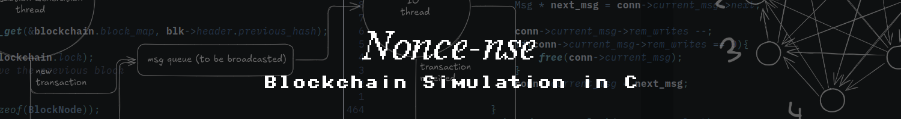
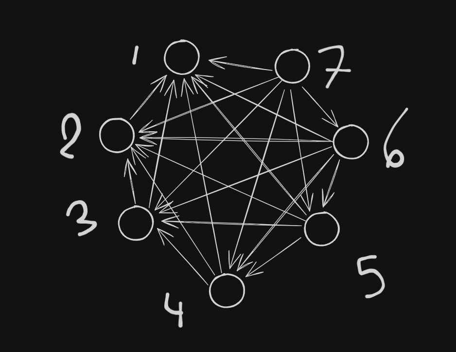

# Noncense: A Distributed Blockchain in C



## Overview

This multi-process, multi-threaded application models a fully connected P2P blockchain network on a single machine communicating over Unix domain sockets. A central orchestrator spawns node processes, which then collaboratively generate transactions, mine blocks, propagate data, resolve forks, and maintain consensus via the longest valid chain.

It combines OS concepts with core blockchain mechanics to achieve efficient, scalable, and realistic behavior.

### Key technical highlights:
- Pure C implementation for maximum control and performance
- Unix domain sockets for low-overhead local P2P communication
- Deterministic full-mesh connection setup (no duplicate connections)
- Edge-triggered epoll for high-efficiency asynchronous I/O
- Multi-threaded nodes with thread-safe message queues

### In-Depth Documentation
  A comprehensive, page-by-page breakdown of the repo is available via [DeepWiki](https://deepwiki.com/B-asmala/distributed-blockchain).  
  *Note: This documentation was generated with AI assistance and may contain minor inaccuracies or outdated details. Use it as a helpful reference, but always verify against the actual source code.*

## Architecture

### Process Structure
- **Orchestrator Process**: Spawns all node processes using `fork()`, sets up socket paths, and coordinates clean shutdown.
- **Node Processes**: Independent full peers, each running three dedicated threads.

### Threading Model (Per Node)


1. **Mining Thread**  
   Performs proof-of-work by brute-forcing nonces. Instantly interruptible when a new valid block arrives from peers.

2. **Transaction Generation Thread**  
   Periodically creates new transactions, signs them and adds them to the local transaction pool (mempool).

3. **I/O Thread**  
   Single-threaded event-driven loop using **edge-triggered epoll** on non-blocking sockets.  
   Handles all network communication for the node with minimal overhead and full scalability:
   - Broadcasts outgoing messages (transactions, blocks) to all peers
   - Receives and parses incoming messages
   - Manages backpressure and partial reads/writes safely

All shared resources (message queue, transaction pool, blockchain) are protected by dedicated mutexes to ensure thread-safe access and prevent data races.

### P2P Network Topology
Fully connected mesh: each pair of nodes establishes exactly one bidirectional Unix domain socket connection (duplicate prevention logic ensures unidirectional setup).



## I/O Subsystem (Edge-Triggered epoll)

The I/O thread implements an event loop built around edge-triggered epoll for maximum efficiency and scalability.

### Advantages
- Single thread handles all input/output for this node (IO multiplexing)
- Scalable to hundreds of connections with a single thread (ET epoll combined with non-blocking file descriptors)
- No head-of-line blocking or lost messages
- Low memory footprint via shared message objects
- Precise resource cleanup and error resilience

### Key Design Features
- **Edge-Triggered Operation**  
  Fully respects ET semantics: drains sockets completely on each event, avoids busy polling, and minimizes system calls.

- **Efficient Broadcasting**  
  Messages are placed on a global thread-safe queue. A single `Msg` object is shared across all connections, tracked via reference counting (`rem_writes`). Messages are freed only after the last connection finishes writing.

- **Backpressure Handling**  
  Slow or congested connections do not block others. Partial writes are tracked per-connection (`written_len`), and `EPOLLOUT` is dynamically enabled/disabled as needed.

- **Non-Blocking Reads with State Machine**  
  Reads until `EAGAIN`, parsing messages via a per-connection state machine (`READ_TYPE → READ_LEN → READ_PAYLOAD`). Partial messages are preserved across events.

- **Incoming Message Verification**  
  Upon receiving a transaction or block:  
  - Transactions are validated (signature verification) before insertion into the pool.  
  - Blocks undergo full validation (valid transactions, Merkle root, block hash, PoW difficulty) before potential chain extension or fork handling.

- **Wakeup Mechanism**  
  An eventfd (`wfd`) notifies the epoll loop when new messages are enqueued, ensuring timely `EPOLLOUT` registration without polling.

- **Memory & Thread Safety**  
    - All shared data structures are protected by dedicated mutexes with minimal critical sections.
    - Message payloads and blocks are immutable after creation — safe for concurrent reads.
    - Global Message Queue: Mutex-protected enqueue/dequeue; wakeup pipe for safe notification to I/O thread.
    - Transaction Pool (Mempool): Mutex guards additions (from tx generation or I/O thread) and reads (by mining thread).
    - Blockchain State: Single mutex protects chain validation, fork detection, and longest-chain updates.

## Blockchain Features

- **Transactions**  
  Structured with sender, receiver, timestamp and amount. signed before broadcasting and mining.

- **Transaction Pool**  
  Local pool of pending transactions; miner selects transactions for inclusion.

- **Blocks**  
  Standard header (prev hash, Merkle root, timestamp, nonce) + transaction list.

- **Merkle Trees**  
  Proper Merkle root computation for transaction integrity.

- **Proof-of-Work Mining**  
  Fixed difficulty for now, responsive interruption on new block arrival.

- **Block & Transaction Propagation**  
  Immediate broadcast of newly mined or received data.

- **Fork Resolution**  
  Tracks multiple chains and switches to the longest valid chain (full deep reorganization planned for future work).

## Limitations & Future Work

- Full chain reorganization on deep forks (orphan handling, uncle blocks)
- Migrate cryptographic operations from deprecated low-level OpenSSL functions to EVP API to eliminate deprecation warnings.
- Persistence to disk
- Node failure simulation and recovery
- Replace full-mesh broadcasting with a scalable gossip protocol

## Build & Run

```bash
# Compile
make

# Run
./bin/orch
```

Socket files are cleaned up on exit.
blockchain files are truncated.

## Why This Project?

Built to explore and master:
- Low-level systems programming in C
- Edge-triggered epoll and non-blocking I/O patterns
- Concurrent, event-driven network architecture
- Backpressure-aware message broadcasting
- Distributed consensus and blockchain mechanics


## Useful Resources
- [learn me a bitcoin](https://learnmeabitcoin.com/technical/block/bits/)
- [Blocking I/O, Nonblocking I/O, And Epoll](https://eklitzke.org/blocking-io-nonblocking-io-and-epoll)